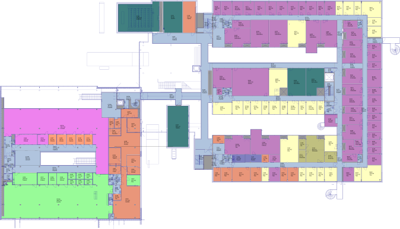
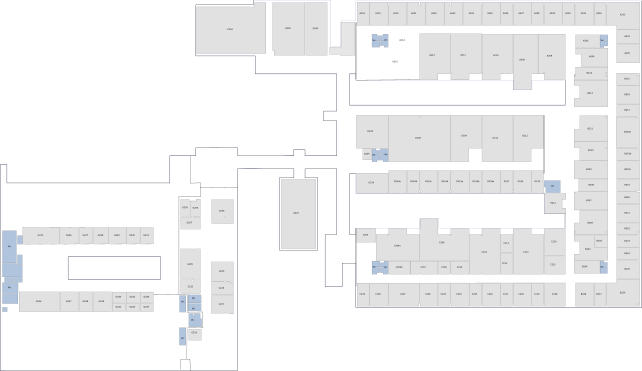

# How to import your own floor plan and OSM basemap

Importing a floor plan has several steps:

1. [Polish and simplify the original floor plan](#1-polish-and-simplify-the-original-floor-plan)
2. [Produce a georeferenced raster file (TIFF file generation)](#2-produce-a-georeferenced-raster-file-tiff-file-generation)
3. [Deploy the georeferenced floor plan](#3-deploy-the-georeferenced-floor-plan)
4. [Deploy your own OpenStreetMap basemap](#4-deploy-your-own-openstreetmap-basemap)

## 1. Polish and simplify the original floor plan

The starting point should be an indoor map, which is preferably in vector format. In principle, a raster file should suffice as well, but the problem is that it should have very high resolution (up to 10k x 10k pixels). Here, we'll assume that the original indoor map is a SVG vector file.

The first step is to polish the vector file. We used [Inkscape](http://inkscape.org), which is freely available. Our initial map looked like this:



This map was simplified by removing non-essential information. Also, the color scheme was simplified so that most areas use only one shade of gray, along with a trasparent  background. After processing, the map looked like this:



Once the map has been polished, it should be exported as a PNG file. We recommend exporting the PNG with a resolution of **288 dpi**. In our case, this gave a PNG file which was about 10k x 5k pixels.

## 2. Produce a georeferenced raster file (TIFF file generation)

The second step is georeferencing. The purpose of georeferencing is to assign geographic coordinates to our raster image, so that it may be overlayed on top of a map. Here, we'll use [QGIS](http://qgis.org), which is freely available.

For this section, we refer to existing tutorials on the QGIS Tutorials site. Please read [Georeferencing Topo Sheets and Scanned Maps (QGIS3)](http://www.qgistutorials.com/en/docs/3/georeferencing_basics.html), and [Georeferencing Aerial Imagery (QGIS3)](http://www.qgistutorials.com/en/docs/3/advanced_georeferencing.html). The former is a basic introduction to the topic, and the latter more advanced. After reading these tutorials you should be able to georeference your own images. Here, we present only a brief overview, and omit many of the details.

Please note that the Georeferencer plugin in QGIS can only handle raster files. That's why, in the previous section, we exported our vector graphic to PNG format.

When it comes to georeferencing, the main job is finding and setting ground control points (GCP). Ground control points specify clearly defined geographic coordinates to specified points on our raster image. For this purpose, we want to identify features on our indoor map which are visible also on the OpenStreetMap basemap. Hence, natural ground control points include corners on the exterior surfaces of buildings. The Georeferencer plugin requires us to set a total of six ground control points.

The following image shows a view from the Georeferencer plugin. The image shows our map after the ground control points have been set, but before starting the georeferencer. The Georeferencer plugin displays each ground control point as a small red dot. The settings used for georeferencing are also shown on the right. The transformation type should be "Polynomial 2" and the coordinate reference system should be EPSG:3857. Also, just in case you are wondering, the floor plan embedded in this image is an intermediate version, not the final version shown above.


After this, it's time to click "Start Georeferencing". This will create a georeferenced TIFF file. The georeferencer will apply a transformation on the input raster, to make it align with the specified geographic coordinates. Sometimes this may make the transformed image look distorted. If this happens, we need to reconsider our ground control points. Changes are that they are not accurate enough, and need to be refined.

## 3. Deploy the georeferenced floor plan

To deploy the georeferenced raster file we need to edit a Dockerfile, which describes a portion of our build process. To be more specific, the file we need to edit is `/maptiles/Dockerfile`. This file should be fairly readable even if you haven't used Docker before. To change the floor plan we'll change the URL portion of the following line

```
RUN mkdir /build && curl -L -o /build/floorplan.tif "https://drive.google.com/uc?export=download&id=..."
```

This fetches our floor plan from Google drive, or some other location you'll specify. If you'd prefer to use a file on your own hard drive, you can modify this line as follows

```
RUN mkdir /build
COPY my-floorplan-v1.tif /build/floorplan.tif
```

This uses the file `my-floorplan-v1.tif` , which should be placed in the same directory `/maptiles`.

You should also modify the configuration parameters `INITIAL_LATITUDE` and `INITIAL_LONGITUDE`, so that the map will be positioned at the correct coordinates. These are part of the application's configuration, and are specified at `/docker-compose.yml` and `/docker-compose.prod.yml`.

If you issue a `docker-compose up --build`, at this point, you should see your new floor plan but no basemap.

## 4. Deploy your own OpenStreetMap basemap

The final step is to update our basemap so that it will cover our geographical location. The default basemap covers the city of Helsinki, Finland but you can replace this with any other location. A basemap refers to the map we see in the background.

At first, we need to create a .mbtiles file which covers our geographical region. For this process, please refer to the documentation [Building a tileset](https://github.com/openmaptiles/openmaptiles#build) on the OpenMapTiles's GitHub page. The basis of this process is an extract of OpenStreetMap data. As these extracts can be quite large, it is advisable to choose just a single city. Nevertheless, the processing of this data will take some time. The end result should be a .mbtiles tileset which can then be served by a TileServer.

Once, you have generated a basemap tileset, we'll once again modify the files in the directory `/maptiles`. From the Dockerfile, we need to update the URL of the tileset

```
RUN mkdir /server && curl -L -o /server/basemap.mbtiles "https://drive.google.com/uc?export=download&id=..."
```

Again, if you'd prefer to use a file on your own hard drive, instead, you can use the commands

```
RUN mkdir /server
COPY our-city.mbtiles /server/basemap.mbtiles
```

This concludes our tutorial. The next time you issue a `docker-compose up --build`, you should see your floor plan on top of an OpenStreetMap basemap. Congratulations, you should now have a working system!
