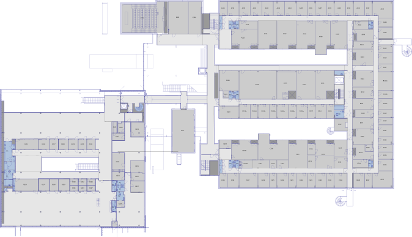
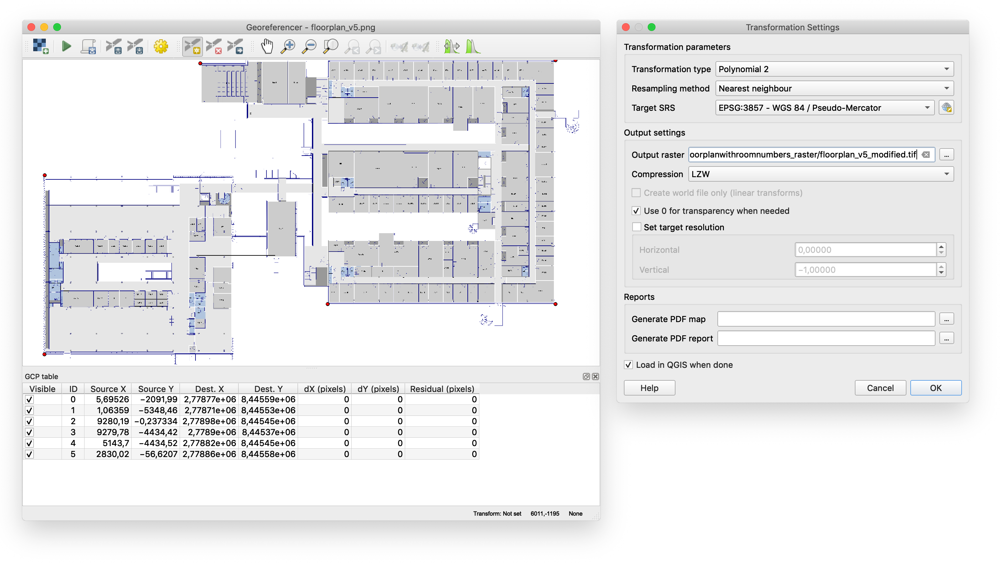

# Map Processing

Indoor map processing has several steps:

1. Polish and simplify the indoor map
2. Produce a georeferenced raster file (TIFF file generation)
3. ...

## 1. Polish and simplify the indoor map

The starting point should be an indoor map, which is preferably in vector format. In principle, a raster file should suffice as well, but the problem is that it should have very high resolution (up to 10k x 10k pixels). Here, we'll assume that the original indoor map is a SVG vector file.

The first step is to polish the vector file. We used [Inkscape](http://inkscape.org) which is freely available. Our initial map looked like this:

This map was simplified by removing non-essential information. Also, the color scheme was simplified so that most areas use only two different shades of gray. After processing, the map looked like this:

Once the map has been polished, it should be exported as a PNG file. We recommend exporting the PNG with a resolution of **288 dpi**. In our case, this gave a PNG file which was about 10k x 5k pixels.

## 2. Produce a georeferenced raster file (TIFF file generation)

The second step is georeferencing. The purpose of georeferencing is to assign geographic coordinates to our raster image, so that it may be overlayed on top of a map. Here, we'll use [QGIS](http://qgis.org) which is freely available.

For this section, we refer to existing tutorials on the QGIS Tutorials site. Please read [Georeferencing Topo Sheets and Scanned Maps (QGIS3)](http://www.qgistutorials.com/en/docs/3/georeferencing_basics.html), and [Georeferencing Aerial Imagery (QGIS3)](http://www.qgistutorials.com/en/docs/3/advanced_georeferencing.html). The former is a basic introduction to the topic, and the latter more advanced. After reading these tutorials you should be able to georeference your own images. Here, we present only a brief overview, and omit many of the details.

Please note that the Georeferencer plugin in QGIS can only handle raster files. That's why, in the previous section, we exported our vector graphic to PNG format.

When it comes to georeferencing, the main job is finding and setting ground control points (GCP). Ground control points specify clearly defined geographic coordinates to specified points on our raster image. For this purpose, we want to identify features on our indoor map which are visible also on the OpenStreetMap basemap. Hence, natural ground control points include corners on the exterior surfaces of buildings. The Georeferencer plugin requires us to set a total of six ground control points.

The following image shows a view from the Georeferencer plugin. The image shows our map after the ground control points (GCP) have been set, but before starting the georeferencer. The settings used for georeferencing are shown on the right. The transformation type should be "Polynomial 2" and the coordinate reference system should be EPSG:3857.

After this it's time to click "Start Georeferencing". This will create a georeferenced TIFF file. The georeferencer will apply a transformation on the input raster, to make it align with the specified geographic coordinates. Sometimes this may make the transformed image look distorted. If this happens, we need to reconsider our ground control points. Changes are that they are not accurate enough, and need to be refined.
